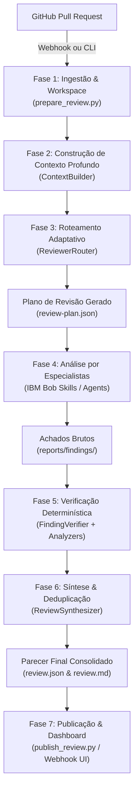

# 🛡️ PR Guardian — Documentação da Aplicação e Fluxo de Atuação

> **Evidence-Based Multi-Agent Pull Request Review powered by IBM Bob**  
> *"Don't just comment. Prove it."*

---

## 1. Visão Geral da Aplicação

O **PR Guardian** é uma plataforma e harness de revisão inteligente de Pull Requests (PRs) orientada a múltiplos agentes especializados (alimentados pelas habilidades e automação do **IBM Bob**).

### O Problema que Resolve
Revisões convencionais baseadas em IA comumente sofrem de:
1. **Análise limitada ao diff**: IA sem visão global do repositório, dependências ou histórico.
2. **Ruído excessivo (Review Noise)**: dezenas de comentários genéricos, palpites subjetivos de estilo ou suposições sem validação.
3. **Falta de verificação determinística**: sugestões publicadas sem qualquer prova de que realmente funcionam ou que há um defeito de fato.
4. **Duplicação de apontamentos**: diferentes agentes reportando a mesma causa raiz com palavras distintas.

### A Abordagem do PR Guardian
O PR Guardian segue quatro princípios fundamentais:
- **Contextual**: analisa arquivos alterados, símbolos, dependências diretas, grafos de chamada, migrações e histórico do repositório antes de acionar qualquer revisor.
- **Adaptativo**: em vez de enviar todo PR para todos os revisores, um roteador identifica sinais de risco (ex: segurança, banco de dados, filas, APIs) e despacha tarefas exclusivamente para especialistas relevantes.
- **Baseado em Evidências**: cada achado significativo (*finding*) é submetido a analisadores determinísticos (linters, SAST, DAST, pytest) ou testes de reprodução isolados antes de ser confirmado.
- **Sintetizado**: deduplica apontamentos, calcula métricas objetivas e gera relatórios claros em JSON e Markdown, publicando no GitHub apenas o que tem alto valor e confiança.

---

## 2. Estrutura de Diretórios e Pastas

Abaixo está o mapa completo da arquitetura do repositório e o papel de cada pasta e componente:

```text
pr-guardian/
├── .bob/                     # Configurações do IBM Bob (Modos, Regras e Skills)
├── analyzers/                # Analisadores estáticos, dinâmicos e executores de testes
├── app/                      # Aplicação Flask (Webhooks e Dashboard de Revisões)
├── benchmark/                # Datasets de teste com vulnerabilidades para aferição
├── bob_sessions/             # Logs, capturas de tela e evidências de execução do Bob
├── docs/                     # Documentação técnica e guias adicionais
├── github/                   # Integração com GitHub API, diffs e webhooks
├── guardian/                 # Núcleo de inteligência, orquestração e contexto
├── models/                   # Modelos de dados de domínio (Pydantic)
├── reports/                  # Artefatos gerados durante os ciclos de revisão
├── repository/               # Utilitários de Git, AST, análise de dependências e call graph
├── schemas/                  # Schemas JSON formais para validação de dados
├── scripts/                  # Scripts CLI operacionais para execução ponta a ponta
├── tests/                    # Suíte completa de testes automatizados (unit e integration)
├── workspace/                # Área temporária de clonagem e inspeção de código
├── app.py / run.py           # Entrypoints para inicialização da aplicação web
├── pyproject.toml            # Metadados do projeto e dependências Poetry/Pip
└── FLUXO.md                  # Este documento arquitetural e de fluxo
```

### Detalhamento das Pastas

#### 📁 `.bob/` (IBM Bob Customization & Skills)
Contém os módulos de agente do IBM Bob, regras de comportamento e as habilidades especializadas:
- `custom_modes.yaml`: Definição de modos de operação do Bob (ex: modo arquiteto, revisor de segurança).
- `rules-agent/` e `rules-plan/`: Diretrizes de execução e planejamento que regem o comportamento dos agentes.
- `skills/`: As 11 habilidades dos revisores especialistas:
  - `pr-understanding`: Leitura, compreensão das intenções e sumarização técnica do PR.
  - `change-impact`: Identificação de impactos colaterais, chamadores, dependências e efeitos de borda.
  - `code-review`: Análise de correção lógica, manutenibilidade, regressões e bugs de implementação.
  - `security-review`: Inspeção contra injeções (SQL/Command), quebra de autenticação/autorização, segredos expostos, etc.
  - `database-review`: Análise de ORM, migrações de schema (ex: Alembic), integridade, índices e consultas N+1.
  - `api-review`: Compatibilidade de endpoints REST/OpenAPI, schemas de entrada/saída e quebras de contrato.
  - `queue-review`: Processamento assíncrono, mensageria (Celery/RabbitMQ), retentativas, idempotência e timeouts.
  - `architecture-review`: Princípios SOLID, limites de camadas, acoplamento e manutenibilidade.
  - `test-impact`: Identificação de lacunas de cobertura, testes afetados e geração de cenários de teste.
  - `finding-verification`: Validação prática e determinística de vulnerabilidades e bugs apontados.
  - `review-synthesis`: Consolidação e desduplicação de todos os achados em um parecer executivo.

#### 📁 `analyzers/` (Ferramentas de Análise Determinística)
Fornece adaptadores padronizados para execução de ferramentas locais:
- `base.py`: Define `AnalyzerResult`, `AnalyzerIssue` e o enum `AnalyzerStatus`.
- `runner.py`: Utilitários para disparar comandos em subprocessos com isolamento e timeout.
- `static/`:
  - `bandit.py`: Análise estática focada em falhas comuns de segurança em Python.
  - `semgrep.py`: Varredura estática baseada em regras semânticas customizadas.
  - `ruff.py`: Linter ultrarrápido para checagens de sintaxe e boas práticas.
  - `pip_audit.py`: Auditoria de vulnerabilidades em dependências Python (CVEs).
- `tests/`:
  - `pytest_runner.py`: Executor do Pytest com captura de relatórios em JSON.
  - `coverage.py`: Medição de cobertura de código nos testes executados.
- `security/`:
  - `zap.py`: Integração com OWASP ZAP para análise de segurança dinâmica.

#### 📁 `app/` (Aplicação Web Flask)
Servidor HTTP leve para recebimento assíncrono de eventos do GitHub e acompanhamento visual:
- `__init__.py`: Factory `create_app()` da aplicação Flask.
- `routes/webhooks.py`: Endpoint `/webhooks/github` para receber eventos de abertura e sincronização de PRs.
- `routes/dashboard.py`: Endpoint `/dashboard` para visualização dos relatórios gerados.
- `services/`: Serviços que conectam os webhooks ao pipeline do Guardian (`review_service.py`, `reviewers.py`, `reviews.py`).
- `templates/` e `static/`: Interface gráfica web para acompanhar o status e o histórico dos reviews.

#### 📁 `benchmark/` (Datasets e Aferição de Precisão)
Datasets de teste para avaliar o desempenho do PR Guardian contra o ground truth:
- `datasets/pr-001/`: Repositório deliberadamente vulnerável com falha de isolamento multitenant (cross-tenant access).
- `datasets/pr-002/`: Repositório com vulnerabilidade de SQL Injection em endpoints de busca.
- `expected-findings/`: Relação de defeitos conhecidos para medição de recall, precisão e taxa de falsos positivos.
- `baseline/` vs `bob-assisted/`: Armazenamento de benchmarks comparativos entre revisões convencionais e revisões guiadas pelo Bob.

#### 📁 `github/` (Camada de Integração GitHub)
Gerencia a comunicação externa sem acoplar o núcleo do Guardian:
- `client.py`: Cliente autenticado para a API REST do GitHub (obtenção de PR, diff, commits e postagem de revisões).
- `diff_mapper.py`: Converte linhas do código-fonte em números de linha dentro do unified diff, permitindo postar comentários inline exatos no GitHub.
- `webhooks.py` e `webhooks_service.py`: Verificação de assinatura criptográfica HMAC-SHA256 e parsing de eventos.
- `pull_request.py`, `reviews.py`, `models.py`: Adaptadores de dados para a API do GitHub.

#### 📁 `guardian/` (Núcleo de Inteligência e Orquestração)
O "cérebro" do PR Guardian:
- `context_builder.py`: Analisa arquivos alterados, executa parsing de AST para extrair classes, funções e símbolos modificados, calcula importações/dependências e detecta sinais de risco (`risk_signals`).
- `router.py`: Motor de regras que avalia os sinais de risco e o contexto para decidir quais revisores especialistas devem rodar e quais podem ser ignorados.
- `finding_verifier.py`: Gerencia a verificação determinística de cada achado encontrado, executando testes de regressão isolados ou ferramentas estáticas.
- `review_synthesizer.py`: Recebe os achados de todos os revisores, deduplica problemas com a mesma causa raiz, classifica a severidade/confiança e estrutura o parecer final.
- `orchestrator.py`: Define os protocolos e interfaces para execução orquestrada de ponta a ponta.
- `metrics.py`: Computa métricas operacionais (linhas alteradas, arquivos afetados, tempo economizado, achados por categoria/severidade).

#### 📁 `models/` (Modelos de Dados do Domínio)
Classes Pydantic fortemente tipadas usadas em todo o sistema:
- `pull_request.py`: Estrutura do PR, repositório, branches, commits e arquivos modificados.
- `finding.py`: Modelo de cada achado de revisão (`Finding`), contendo título, descrição, severidade, confiança, arquivo, linha, evidência e recomendação.
- `verification.py`: Estrutura do resultado de verificação determinística.
- `review.py`: Estrutura consolidada do review final (`ReviewSummary`, `ReviewFinding`).
- `metrics.py`: Métricas de execução do review.

#### 📁 `repository/` (Análise Local de Código e Git)
Módulos responsáveis por inspecionar o código do projeto alvo:
- `clone.py`: Clona ou atualiza o repositório em um diretório temporário do `workspace/`.
- `diff.py`: Extrai e processa unified diffs entre o branch base e o branch head.
- `files.py`: Filtra arquivos relevantes (ignora assets binários, lockfiles, etc.).
- `history.py`: Analisa histórico recente de commits e autores dos arquivos alterados.
- `dependencies.py`: Faz parsing de imports em arquivos Python para rastrear quem depende do código modificado.
- `call_graph.py`: Constrói o grafo de chamadas de funções/métodos usando a AST do Python.

#### 📁 `reports/` (Armazenamento de Artefatos Gerados)
Cada ciclo de revisão gera artefatos persistidos e auditáveis:
- `raw/<id>/`: Dados brutos, incluindo `pr-context.json`, `routing.json` e `review-plan.json`.
- `findings/<id>/`: Arquivos JSON de achados produzidos por cada revisor especialista.
- `verification/<id>/`: Resultados detalhados de verificação determinística (`verification-results.json`).
- `reviews/<id>/`: O parecer final sintetizado: `review.json` (estruturado) e `review.md` (formatado para humanos).
- `metrics/<id>/`: Métricas consolidadas da revisão (`metrics.json`).

#### 📁 `schemas/` (Contratos JSON)
- `finding.schema.json`: Validação estrita do formato de cada `Finding`.
- `verification.schema.json`: Validação do formato de resultados de verificação.

#### 📁 `scripts/` (Linha de Comando e Automação)
- `prepare_review.py`: Realiza a Fase 1 (extrai PR, clona repositório, constrói contexto, roteia especialistas e gera o `review-plan.json`).
- `finalize_review.py`: Realiza a Fase 2 (lê achados dos revisores, executa verificações de evidência, deduplica achados e gera `review.json` e `review.md`).
- `publish_review.py`: Realiza a Fase 3 (lê o `review.json` e envia os comentários inline e parecer geral para o PR no GitHub).
- `validate_artifact.py`: Utilitário para validar arquivos JSON contra os schemas da pasta `schemas/`.

#### 📁 `tests/` (Testes Automatizados)
- `unit/`: Testes unitários de cada módulo (`test_context_builder.py`, `test_router.py`, `test_review_synthesizer.py`, etc.).
- `integration/`: Testes de integração de fluxo completo e validação contra os cenários vulneráveis dos benchmarks (PR-001 e PR-002).

---

## 3. Fluxo de Atuação da Aplicação (Pipeline Ponta a Ponta)

O ciclo de vida de uma revisão no PR Guardian é dividido em 7 fases bem coordenadas:



---

### Passo a Passo Detalhado do Fluxo

### 🔹 Fase 1: Ingestão e Preparação do Workspace
- **Gatilho**: Pode ser acionado automaticamente via Webhook do GitHub (`/webhooks/github`) ou manualmente via terminal executando:
  ```bash
  python3 scripts/prepare_review.py --pr owner/repo#123
  ```
- **Ações**:
  1. Conecta-se à API do GitHub e baixa os metadados do PR (título, descrição, base SHA, head SHA, lista de arquivos alterados e patches).
  2. Inicializa uma área isolada em `workspace/<repo_name>` via `repository/clone.py`.
  3. Garante que as branches corretas estejam com checkout e sincronizadas.

### 🔹 Fase 2: Construção de Contexto Profundo (`ContextBuilder`)
- Ao invés de olhar apenas para o arquivo `diff`, o `guardian/context_builder.py` realiza uma auditoria contextual:
  - **Símbolos Modificados**: Utiliza AST para listar classes, métodos e funções afetadas.
  - **Grafo de Dependências**: Identifica quais módulos do projeto importam ou são importados pelos arquivos modificados.
  - **Sinais de Risco (`risk_signals`)**: Varre o código e os caminhos alterados buscando indicadores críticos:
    - *Segurança*: termos como `auth`, `token`, `password`, `jwt`, `role`, `permission`.
    - *Banco de Dados*: termos como `migration`, `sql`, `select`, `update`, `query`, `repository`.
    - *Filas e Tarefas*: termos como `celery`, `task`, `queue`, `worker`, `retry`.
    - *APIs*: termos como `route`, `endpoint`, `api`, `request`, `response`, `openapi`.

### 🔹 Fase 3: Roteamento Adaptativo (`ReviewerRouter`)
- O `guardian/router.py` processa os arquivos e os sinais de risco detectados e seleciona **apenas** os revisores relevantes:
  - Se alterou apenas documentação (`README.md`): seleciona apenas revisores de documentação/compreensão.
  - Se alterou SQL ou migrações: ativa `code-review`, `database-review` e `test-impact`.
  - Se alterou autenticação/autorização: ativa `code-review`, `security-review` e `test-impact`.
- **Artefatos Gerados**:
  - `reports/raw/<id>/pr-context.json`: todo o contexto estático extraído.
  - `reports/raw/<id>/routing.json`: justificativa dos revisores acionados e ignorados.
  - `reports/raw/<id>/review-plan.json`: o plano de trabalho unificado contendo o passo a passo para os agentes do Bob.

### 🔹 Fase 4: Execução dos Especialistas (Agentes IBM Bob)
- Cada especialista acionado pelo plano de revisão executa sua respectiva skill de `.bob/skills/<skill-name>/`:
  - Examina o contexto gerado e o código-fonte no workspace.
  - Produz achados estruturados contendo categoria, severidade sugerida, arquivo, linha, impacto e recomendação.
  - Grava os achados em `reports/findings/<id>/<reviewer-name>.json`.

### 🔹 Fase 5: Verificação Determinística Baseada em Evidências (`FindingVerifier`)
- **Princípio**: *"Não apenas comente. Prove."*
- O `guardian/finding_verifier.py` pega os achados mais críticos e executa verificações práticas:
  - Dispara linters e analisadores estáticos da pasta `analyzers/` (ex: `bandit`, `semgrep`, `ruff`).
  - Executa suítes de testes automatizados com `pytest_runner.py`.
  - Localiza ou gera testes de reprodução isolados para verificar se a vulnerabilidade ou defeito ocorre de verdade.
- **Classificação de Status de Verificação**:
  - `VERIFIED`: O teste ou ferramenta comprovou deterministicamente a existência da falha.
  - `UNVERIFIED`: Evidência plausível encontrada pela IA, mas sem teste automatizado reproduzível no momento.
  - `NOT_APPLICABLE`: Achados de cunho informativo ou arquitetural que não dependem de teste executável.
  - `VERIFICATION_FAILED`: A tentativa de reprodução determinística falhou (não provou a falha).

### 🔹 Fase 6: Síntese e Desduplicação (`ReviewSynthesizer`)
- O script `scripts/finalize_review.py` invoca o `guardian/review_synthesizer.py`:
  - Carrega todos os achados brutos e os resultados de verificação.
  - **Deduplicação**: Agrupa achados que apontam para o mesmo local e mesma causa raiz (ex: o revisor de segurança e o de código apontando a mesma falta de sanitização em uma linha).
  - **Filtragem de Ruído**: Descarta sugestões irrelevantes ou preferências subjetivas de formatação.
  - **Priorização**: Ordena os achados por Severidade (`CRITICAL` > `HIGH` > `MEDIUM` > `LOW` > `INFO`) e Confiança (`CONFIRMED` > `LIKELY` > `POTENTIAL` > `INFORMATIONAL`).
- **Artefatos Finais**:
  - `reports/reviews/<id>/review.json`: parecer unificado pronto para automações.
  - `reports/reviews/<id>/review.md`: parecer elegante formatado em Markdown, com tabelas de resumo e sugestões de correção.

### 🔹 Fase 7: Publicação e Apresentação
- **Publicação no GitHub**:
  - Executando `python3 scripts/publish_review.py --pr owner/repo#123`:
    - Converte números de linha em posições no diff via `github/diff_mapper.py`.
    - Publica comentários inline específicos nos arquivos modificados (focando em achados `CONFIRMED` e `LIKELY`).
    - Publica o parecer geral no corpo principal da revisão do PR no GitHub.
- **Painel Web**:
  - A aplicação Flask disponibiliza a rota `/dashboard` onde o time de engenharia pode auditar os reviews executados, consultar métricas de tempo economizado e visualizar a taxa de verificação.

---

## 4. Classificação de Severidade e Confiança

Para garantir transparência e evitar alarmes falsos, o PR Guardian separa categoricamente **Severidade Técnica** de **Grau de Confiança**:

| Dimensão | Níveis | Significado |
|---|---|---|
| **Severidade** | `CRITICAL`, `HIGH`, `MEDIUM`, `LOW`, `INFO` | Impacto no sistema caso o problema ocorra em produção. |
| **Confiança** | `CONFIRMED` | Comprovado por teste determinístico ou evidência reproduzida. |
| | `LIKELY` | Forte evidência estática/lógica, sem teste automatizado completo. |
| | `POTENTIAL` | Risco plausível que requer revisão humana adicional. |
| | `INFORMATIONAL` | Observação arquitetural ou contextual. |
| **Verificação** | `VERIFIED` | Reprodução executada com sucesso e comprovada. |
| | `UNVERIFIED` | Não submetido ou sem teste de reprodução disponível. |
| | `NOT_APPLICABLE` | Não aplicável a testes de execução direta. |

---

## 5. Como Executar a Aplicação

### 1. Configuração do Ambiente
Copie o arquivo de exemplo de variáveis de ambiente e instale as dependências:
```bash
cp .env-example .env
python3 -m venv .venv
source .venv/bin/activate
pip install -r requirements.txt
pip install -e .
```

### 2. Execução da Suíte de Testes
```bash
pytest
```

### 3. Execução Manual do Ciclo de Revisão (CLI)
```bash
# Passo 1: Preparar o contexto e o plano de revisão
python3 scripts/prepare_review.py --pr owner/repositorio#42

# Passo 2: Finalizar e sintetizar a revisão após análise dos revisores
python3 scripts/finalize_review.py --pr owner/repositorio#42

# Passo 3: (Opcional) Publicar a revisão no GitHub
python3 scripts/publish_review.py --pr owner/repositorio#42
```

### 4. Execução do Servidor Web e Webhooks
```bash
python3 run.py
# Acesso ao Dashboard: http://localhost:5000/dashboard
# Endpoint de Webhooks: http://localhost:5000/webhooks/github
```

---
*Documentação gerada para o PR Guardian — Hackathon IBM Bob 2.0.*
